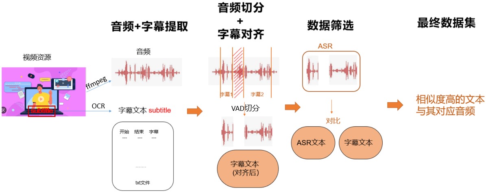

# asr-data

### 流程图


### 运行步骤
#### 1. 音频+字幕提取，对齐

数据储存结构
```
| - 数据储存路径
    | - 000
        | - 000
        | - 001
        | - ...
        | - n
    | - 001
        | - 000
            | - hash_id
                | - hash_id.mp3
                | - hash_id-segments.txt
                | - hash_id-timeline.txt 
                | - hash_id-trans.txt
                | - hash_id-wav_scp.txt
                | - hash_id-speeches-raw.txt
                | - hash_id-subtitles-raw.txt
    | - ...
    | - n (由subdir_count决定，default=512)
```
运行代码
```
cd extractor
export CUDA_VISIBLE_DEVICES=gpu_num && python3 ./main.py --video_dir vd --audio_dir ad --mp mp --run_forever --delete_video
```
参数解析
- CUDA_VISIBLE_DEVICES: 使用哪块GPU运行程序，default=0。当需要多块GPU并行运行程序时使用
- video_dir: 进行提取的视频储存路径 (必填)
- audio_dir: 提取出的音频及字幕的储存路径 (必填)
- mp: 同时有运行的进程数量，default = 1
- run_forever: True时在现有视频全部提取完毕后，不结束进程，一直等待新视频，default = True
- video_name_hash: True时储存音频及字幕时以视频名字的hash id来命名，default = True
- delete_video: True时在提取音频及字幕结束后将原视频删除
- video_format: 被提取的视频的格式，default = 'mp4'
- audio_format: 提取的音频的格式, default='mp3'
- subdir_depth: 子路径深度， default=2
- subdir_count: 储存路径的文件数，default=512. 总文件夹数 = subdir_count ^ subdir_lenth (512*512). 

生成文件解析
- hash_id.mp3：音频文件
- hash_id-speeches-raw.txt：记录有声音的时间，<开始时间 结束时间>
- hash_id-subtitles-raw.txt：字幕文件，<帧数 字幕>
- hash_id-segments.txt：根据raw subtitile拼接相同的字幕得到每句字幕的时间，<hash_开始时间_结束时间>
- hash_id-trans.txt：对应segment和字幕，<hash_开始时间_结束时间 字幕>
- hash_id-timeline.txt：字幕文件，<开始时间 结束时间 字幕>
- hash_id-wav_scp.txt：字幕时间对应的音频文件，<hash_开始时间_结束时间 音频文件路径>

#### 2. 使用ASR生成转译文本
```
cd extractor
python asr-websocket.py -m num --audio_dir ad
```
参数解析
- m: multicore, 并行运行数，default = 1
- audio_dir: 储存音频+字幕的路径（必填）

#### 3. 将ASR转移文本与字幕对比，找到相似度高的数据
```
cd extractor
python verify_by_asr.py verify --audio_dir ad
```
参数解析
- cmd value
  - verify: 验证ASR转移文本和字幕文本相似度
    - audio_dir：储存音频+字幕的路径（必填）
    - text_extract: 字幕文件路径
    - text_asr: asr转译结果路径。如果audio_dir未提供，则需要提供text_extract和text_asr
  - merge：将已验证的相似性>96%的音频和字幕分别拼接
    - audio_dir：储存音频+字幕的路径（必填）
  - 如果未提供cmd value, 则default split_data, 将数据分为train，test，dev data。default 比例为9:0.5:0.5
    - text：字幕路径
    - scp：音频名称路径
 
生成文件解析
- verify
```
| - hash_id-verified-100.txt: 相似度为100%的字幕及对应音频名称
| - hash_id-verified-99.txt: 相似度为99%的字幕及对应音频名称
| - hash_id-verified-96.txt: 相似度为96%的字幕及对应音频名称
| - hash_id-verified-xx.txt: 相似度为<96%的字幕及对应音频名称
| - hash_id-verified-00.txt: 相似度为0的字幕及对应音频名称
```
- merge
```
| - z-merged-trans.txt: 相似度>96%的所有字幕汇总
| - z-merged-wav_scp.txt: 相似度>96%的所有音频位置汇总
```
- split_data
```
| - z-good-trans-dev.txt：字幕dev文件
| - z-good-trans-test.txt：字幕test文件
| - z-good-trans-train.txt：字幕train文件
| - z-good-wav_scp-dev.txt：音频路径dev文件
| - z-good-wav_scp-test.txt：音频路径test文件
| - z-good-wav_scp-train.txt：音频路径train文件
```